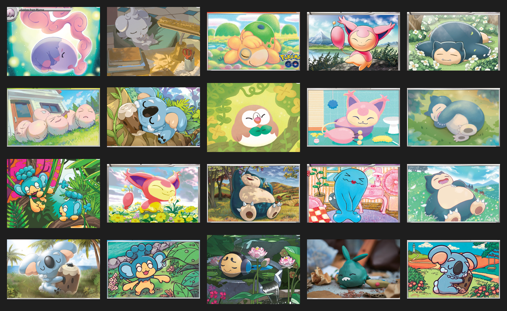
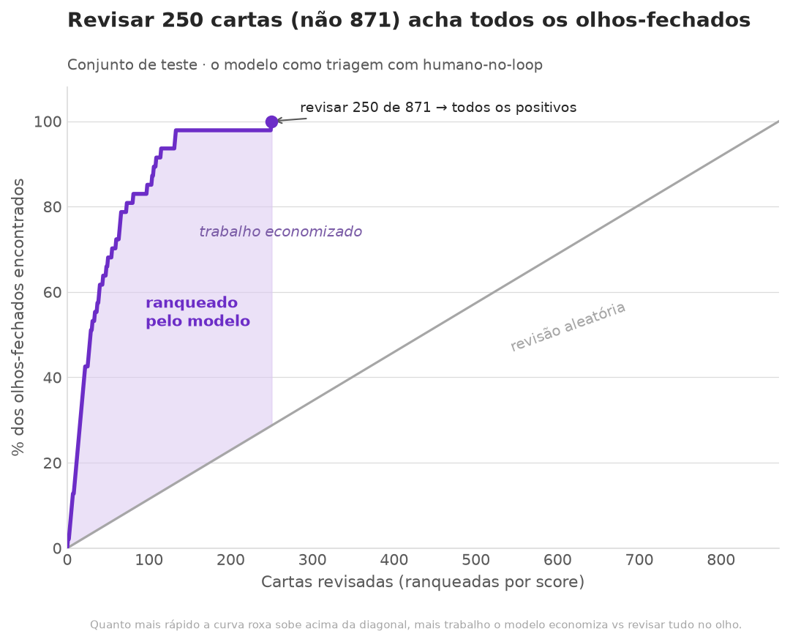
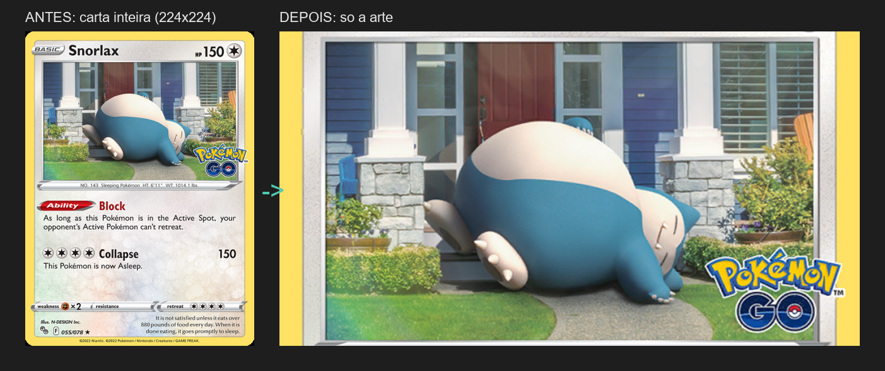
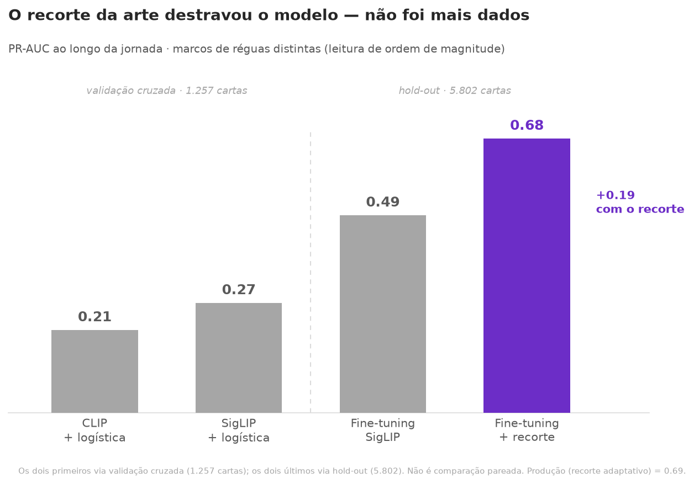
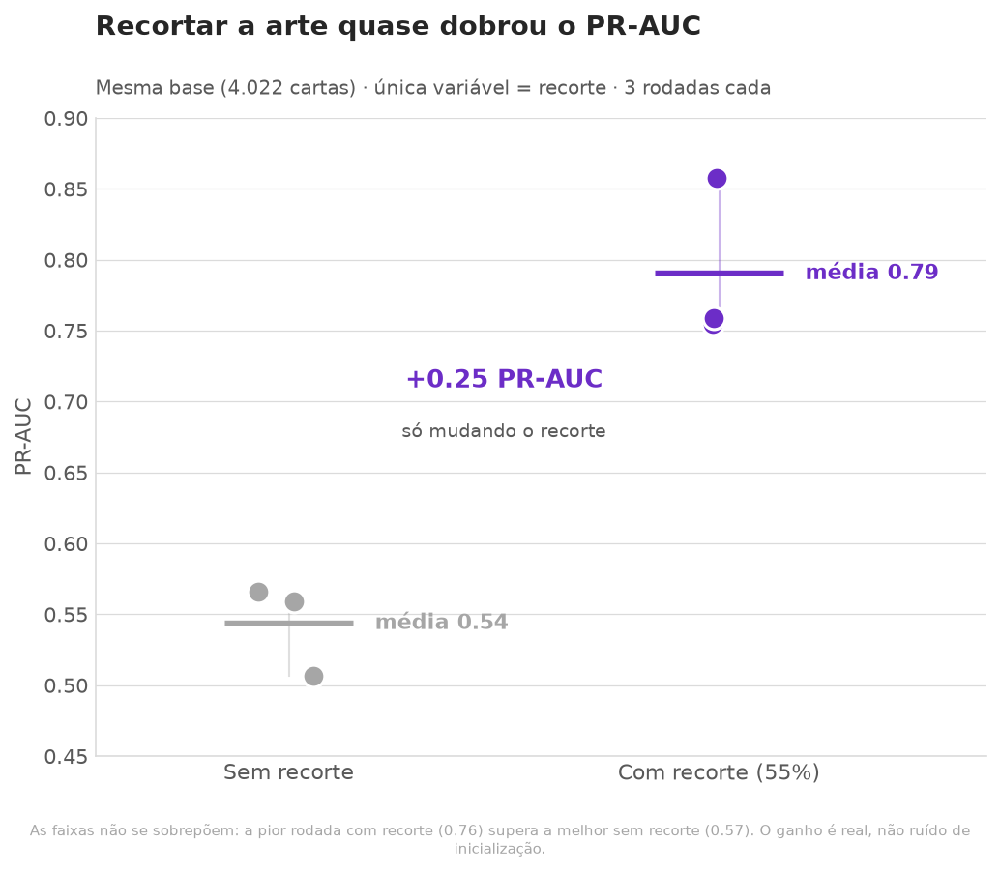
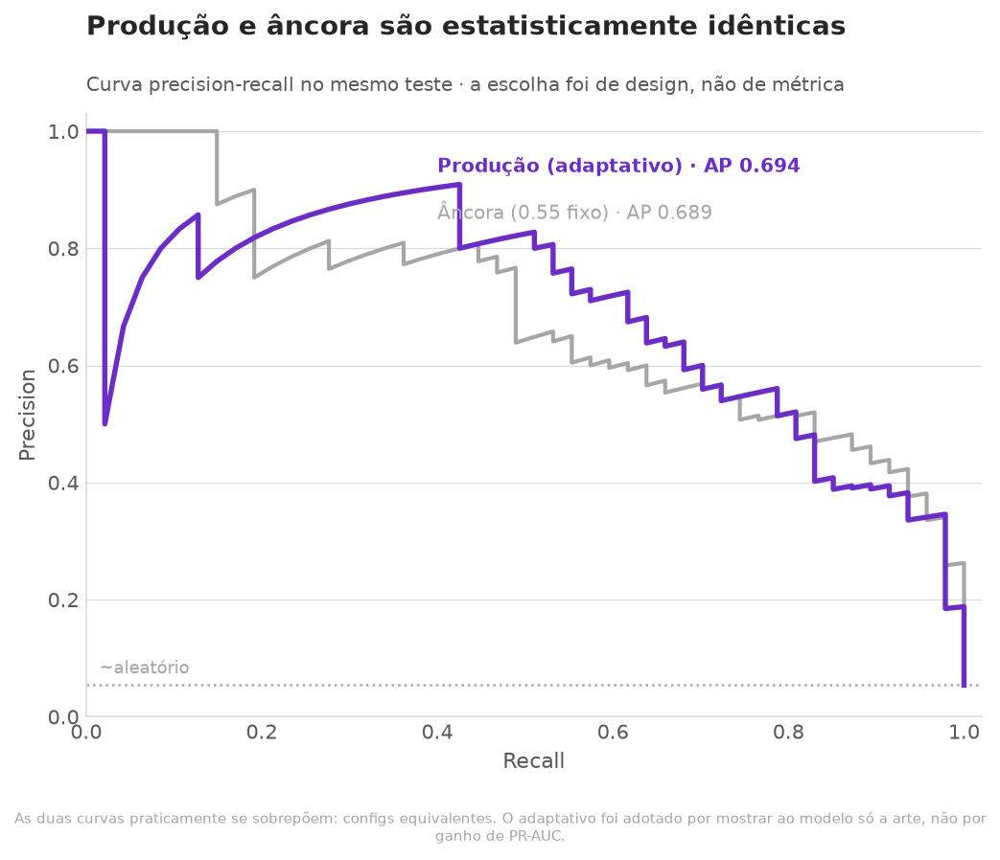

# Pokémon Sleep Classifier

Tria ~12 mil cartas de Pokémon TCG por Pokémon de **olhos fechados** — um proxy visual para "dormindo" — e gera uma lista de compras priorizada para revisão humana.



> *Achados do modelo: cartas de olho fechado que ele rankeou no topo e que não estavam no conjunto rotulado à mão.*

---

## Resumo

Uma coleção temática — cartas de Pokémon TCG em que o Pokémon está dormindo — esbarra num gargalo: garimpar à mão ~12 mil cartas atrás das poucas que servem é inviável. Este projeto resolve isso com visão computacional: um modelo rankeia todas as cartas por probabilidade de **olhos fechados** (o proxy operacional de "dormindo") e devolve uma **lista de compras priorizada**, para uma pessoa confirmar no fim — humano-no-loop.

- **Precisão onde importa:** entre as candidatas que o modelo descobriu (não estavam rotuladas à mão), as **50 primeiras são 100% acertos**; as 300 primeiras, **~94%**.
- **Trabalho economizado:** no conjunto de teste, as cartas mais bem rankeadas recuperam **todos os positivos revisando ~1/3 do total** — o resto pode ser ignorado com segurança.
- **Generalização real:** o modelo achou cartas válidas entre **~6.400 cartas nunca vistas** no treino, incluindo uma era inteira (Mega) ausente do conjunto de treino.
- **Status:** MVP funcional — pipeline completo (ingestão → recorte → treino → lista), modelo de produção definido, lista gerada e validada à mão.

---

## O problema

Minha companheira coleciona uma categoria muito específica de cartas de Pokémon TCG: aquelas em que o Pokémon aparece **dormindo**. O problema é de escala — o universo de cartas relevantes passa de **12 mil**, e garimpar uma a uma, à mão, atrás das poucas que servem é inviável.

"Dormindo", porém, é um alvo difícil para um classificador de imagem. É um conceito de **cena**: o modelo teria que inferir um *estado* a partir de pose, ambiente, contexto e expressão somados — e ensinar (ou validar) isso num MVP custaria tempo e dados que não se justificam. Então tomei uma decisão de produto: trocar o alvo conceitual por um **proxy visual, local e objetivamente rotulável** — **olhos fechados**. Olho fechado é um detalhe na arte que um classificador captura bem, e correlaciona forte com "dormindo".

O proxy não é perfeito — um Pokémon pode estar de olhos fechados acordado (rindo, piscando) ou dormindo de olhos abertos —, mas captura a grande maioria dos dorminhocos e troca um problema vago por um mensurável. É uma escolha permanente deste produto, não um atalho temporário.

A solução é uma **ferramenta de curadoria, não um classificador autônomo**: o modelo rankeia as cartas por probabilidade de olhos fechados e uma pessoa confirma as candidatas do topo — **humano-no-loop**. Por isso a métrica que guia o projeto é o **recall** (não deixar positivos de fora pesa mais que um falso positivo ocasional, que o humano descarta na revisão).

Escopo deste MVP: as **6 eras mais recentes** do TCG (Black & White em diante). As eras fundadoras, anteriores a Black & White, ficaram fora desta versão.

---

## O que o modelo entrega

O produto final é uma **lista de compras**: as ~12 mil cartas do universo de inferência, ranqueadas por probabilidade de olhos fechados, com as já-conhecidas marcadas e as **candidatas novas** (o que o modelo descobriu sozinho) em destaque para revisão.

**Na lista real (universo de inferência, ~12 mil cartas).** Validei à mão o topo do ranking: entre as candidatas que o modelo descobriu — cartas que *não* estavam no conjunto rotulado —, as **50 primeiras são todas acertos** (100%) e as **300 primeiras, ~94%**. A qualidade decai como ladeira suave: os poucos erros se concentram mais embaixo, onde o score já caiu e a revisão humana opera em modo cético — o lugar certo para errar numa ferramenta com humano-no-loop.

**Generalização (treino → inferência).** O modelo foi treinado em 5 eras (~5.800 cartas) e aplicado a 6 (~12 mil). Ou seja, encontrou cartas válidas entre **~6.400 cartas que nunca viu no treino**, incluindo uma **era inteira (Mega) ausente do conjunto de treino** — evidência de que aprendeu o traço "olho fechado", não decorou as cartas conhecidas.

**No conjunto de teste controlado (871 cartas, com gabarito completo).** Onde dá para medir recall de verdade, a triagem se paga: ranqueando pelo modelo, recuperar **todos os positivos exige revisar só ~1/3 das cartas** — os outros dois terços podem ser ignorados com segurança. É o trabalho economizado de uma triagem automática vs. revisar tudo no olho:



---

## Como funciona

O sistema é um classificador de imagem por **transfer learning**, com quatro componentes:

**1. Backbone de visão.** Uso o **SigLIP2** (`ViT-B-16-SigLIP2`) como extrator de características — um modelo de visão pré-treinado que se mostrou sensível a detalhes locais finos, justamente o que o problema exige (um olho fechado ocupa ~1-2% da carta).

**2. Fine-tuning cirúrgico.** Em vez de treinar a rede inteira (caro, e com poucos positivos rotulados levaria a *overfitting*), congelo quase tudo e descongelo só os **2 últimos blocos** do backbone + uma cabeça de classificação binária. Capacidade suficiente para a rede reorganizar a representação em torno de "olho fechado", sem memorizar os exemplos de treino.

**3. Recorte adaptativo da arte — o componente que faz o sistema funcionar.** Antes de ir ao modelo, cada carta é **recortada para mostrar só a arte**, descartando moldura, nome, HP, texto de ataques e história. O motivo: a imagem é redimensionada para 224×224 antes de entrar na rede, e nesse encolhimento um olho fechado de ~1-2% da carta simplesmente **desaparece**. Recortar concentra os pixels no que importa. A janela de corte é **adaptativa por raridade** — ajusta-se ao tipo de carta —, definida por uma fonte única de regras, idêntica no treino e na inferência.



**4. Ranking com humano-no-loop.** O modelo produz uma probabilidade de "olhos fechados" por carta; as ~12 mil são ordenadas por esse score, gerando a lista de compras. O modelo não decide sozinho — ele **prioriza**, e a revisão humana confirma o topo.

Treino desbalanceado por natureza (~5% de positivos): o modelo é otimizado com peso maior na classe rara, para favorecer **recall** — coerente com o objetivo de não perder cartas.

---

## A jornada: o gargalo não era o que eu pensava

A versão final parece óbvia em retrospecto, mas o caminho até ela foi um diagnóstico — e a lição mais valiosa do projeto está em *onde o gargalo realmente estava*.

Comecei pelo caminho intuitivo. O primeiro modelo mal saía do aleatório, e os dois suspeitos óbvios eram **dados** (poucos positivos rotulados) e **capacidade** (rede pequena demais). Persegui os dois por vários experimentos: rotulei mais cartas à mão, troquei o backbone, descongelei mais e menos camadas. Cada passo rendia pouco — e um deles ensinou uma lição contraintuitiva: **adicionar mais dados chegou a piorar** o modelo, quando os dados novos eram redundantes (mais do mesmo, diluindo o sinal com negativos). "Mais dados" não é monotônico.



O destravamento veio de outro lugar. Uma auditoria dos erros mostrou o modelo errando olhos fechados **óbvios** — e a ficha caiu: o olho ocupa ~1-2% da carta e **desaparecia** quando a imagem inteira era encolhida para 224×224. O gargalo nunca foi dados nem capacidade — era **resolução**. A informação não chegava intacta à rede. Recortar a arte (descartar moldura e texto) dobrou a fração útil da imagem, e o PR-AUC saltou de ~0.49 para ~0.68. O maior ganho do projeto veio de uma mudança no **pré-processamento**, não de mais dados ou de um modelo maior:



Depois do recorte, o teto apareceu. Testei se o modelo se apoiava no texto da carta (um possível atalho) cortando a faixa de nome/HP: **neutro** — ele já olhava a arte. E o **recorte adaptativo por raridade** (Exp. 16), hoje o modelo de produção, também deu **neutro** frente ao recorte fixo — estatisticamente equivalente. Adotei o adaptativo mesmo assim, por **design** (mostrar ao modelo só a arte, não por ganho de métrica — ver *Decisões de produto*). Dois resultados nulos seguidos não foram fracasso: foram o sinal de que o projeto havia atingido o teto útil do problema, e a hora de parar de afinar e entregar.

*A narrativa completa dos 16 experimentos — hipóteses, métodos e resultados, inclusive os negativos — está em [`EXPERIMENTS.md`](EXPERIMENTS.md).*

---

## Decisões de produto

Boa parte do que define este projeto não está no modelo, mas nas decisões em torno dele. Três já apareceram acima — o **proxy** olhos-fechados para "dormindo" (ver *O problema*), o desenho **humano-no-loop** e o **recall** como métrica-norte. Duas outras merecem destaque, porque são onde o raciocínio de produto mais aparece.

**Recorte adaptativo: adotado por design, não por métrica.** O modelo de produção usa um recorte cuja janela varia por raridade da carta. Quando comparei essa versão contra o recorte fixo, o resultado foi **estatisticamente neutro** — as duas são equivalentes dentro do ruído entre rodadas (PR-AUC 0.693 vs 0.678, faixas sobrepostas). Adotei o adaptativo mesmo assim, e a justificativa é de **design**, não de performance: se o objetivo é o modelo decidir pela *arte*, a entrada certa é aquela que mostra a ele o **máximo de arte e o mínimo de moldura e texto** — esteja o modelo se apoiando nesse ruído hoje ou não. Como custa zero de performance, escolho a entrada mais fiel ao objetivo, com o benefício colateral de reduzir a superfície para *shortcut learning* em eras e layouts futuros. (A equivalência vale para as configurações testadas; detalhe completo em [`EXPERIMENTS.md`](EXPERIMENTS.md).)



**Modelo de produção: a mediana, não o melhor.** O treino tem variação de inicialização — rodar a mesma configuração três vezes dá três resultados um pouco diferentes (no caso, PR-AUC 0.694 / 0.709 / 0.675). Para escolher o modelo que vai a produção, peguei a **rodada mediana** (0.694), não a de maior número. Escolher o melhor de três é se enganar: a rodada de sorte parece ótima no teste, mas não se repete em dados novos — ela "voltaria pra média". A mediana é a estimativa honesta do que o modelo realmente entrega, e é coerente com a regra que guiou todo o projeto: **um número isolado é ruído; só o conjunto de várias rodadas decide.**

---

## Stack e reprodutibilidade

**O que está por trás.** O projeto é todo em **Python**, usando **PyTorch** para o modelo (com aceleração por GPU) e o **SigLIP2** como backbone de visão, via a biblioteca `open_clip`. O resto é o ferramental usual de ciência de dados — `pandas` e `numpy` para os dados, `scikit-learn` para as métricas, `Pillow` para o recorte das imagens, e `matplotlib` para os gráficos deste README. Os dados vêm da **TCGdex**, uma API pública e gratuita de cartas de Pokémon TCG.

**Dois universos de dados, propositadamente separados.** O projeto trabalha com dois conjuntos distintos, e confundi-los já causou um bug real (documentado no [`EXPERIMENTS.md`](EXPERIMENTS.md)):

- **Desenvolvimento** — **5.836 cartas** de 38 sets (5 eras: Black & White até Scarlet & Violet), com **311 positivos rotulados à mão**. É onde o modelo treina, valida e é testado.
- **Inferência** — **12.249 cartas** de 6 eras (as 5 acima + Mega), onde o modelo treinado é aplicado para gerar a lista de compras. As ~6.400 cartas a mais nunca foram vistas no treino.

**Reproduzível por código, não por arquivos soltos.** Os catálogos e imagens não ficam no repositório (são pesados e recriáveis), mas o universo de desenvolvimento é **reconstruído por um script** a partir da lista canônica dos 38 sets — então qualquer clone regenera exatamente a mesma base de treino, sem depender de nenhum arquivo que possa se perder. Os rótulos (`positivos_ids.csv`, a única fonte que *não* é recriável) são versionados no repositório.

**Como rodar** (do zero; requer GPU com CUDA — referência: ~35-40 min por rodada de treino numa RTX 2060):

```bash
# 1. Ingerir o universo completo (~12k cartas + imagens da TCGdex; demora pela rede)
python -m pokemon.dados.ingestao_universo

# 2. Reconstruir o catálogo de desenvolvimento (os 5.836, de forma reproduzível)
python -m pokemon.dados.regenerar_catalogo_dev

# 3. Montar o gabarito de treino a partir dos rótulos versionados
python -m pokemon.dados.montar_gabarito

# 4. Treinar (3 rodadas; o modelo de produção é a rodada mediana)
python -m pokemon.modelagem.rodar_treinamento

# 5. Gerar a lista de compras (pontua as ~12k com o modelo de produção)
python -m pokemon.analise.gerar_lista_compras

# 6. (Opcional) Gerar os gráficos deste README
python -m pokemon.diagnosticos.viz_evolucao_prauc
python -m pokemon.diagnosticos.viz_recorte_controlado
python -m pokemon.diagnosticos.viz_avaliacao_producao
```

Rodar do zero re-baixa as imagens da TCGdex (as ~12k não acompanham o repositório); reserve tempo de rede para o passo 1.

---

## Limitações e próximos passos

Um MVP honesto sabe o que ainda não resolve. As limitações conhecidas:

- **Cobertura de eras.** O escopo são as 6 eras mais recentes (Black & White em diante). As eras fundadoras do TCG, anteriores a Black & White, ficaram de fora.
- **Cartas sem imagem.** ~356 cartas do universo não têm imagem disponível na TCGdex e, por isso, ficam fora da inferência — um ponto cego que o modelo não alcança.
- **Cartas com múltiplos Pokémon.** A regra considera positiva a carta se *ao menos um* Pokémon está de olhos fechados, mas o classificador enxerga a imagem inteira — cenas com vários Pokémon, só alguns dormindo, são intrinsecamente ambíguas.
- **O proxy.** Olhos fechados não é exatamente "dormindo" (ver *O problema*): há Pokémon de olhos fechados acordados e dorminhocos de olhos abertos. É uma troca consciente e permanente, mas vale lembrar que define o que o produto encontra.
- **Recorte fixo por raridade.** A janela de corte é a mesma para toda carta de uma dada raridade — não se adapta à composição individual da arte.

Os próximos passos, em ordem de retorno provável:

- **Recorte guiado por detecção.** Hoje o recorte é uma janela fixa por raridade. O passo natural é um recorte **inteligente**: detectar o rosto (ou o Pokémon) na arte e recortar com precisão em volta dele, em vez de assumir uma posição. Como o recorte foi a maior alavanca do projeto, refiná-lo é a aposta mais promissora.
- **Active learning.** As candidatas que a revisão humana confirmar viram novos positivos no gabarito; re-treinar com elas melhora o modelo, que gera uma lista melhor, que gera novos positivos — um ciclo que se retroalimenta.
- **Expandir a cobertura.** Estender a ingestão às eras fundadoras do TCG, levando o produto à coleção completa.
- **Janela maior para full-arts.** Uma hipótese de recorte que ficou testada só pela metade (ver [`EXPERIMENTS.md`](EXPERIMENTS.md)): alargar a janela nas cartas full-art, onde a arte ocupa o quadro inteiro, ainda pode render.